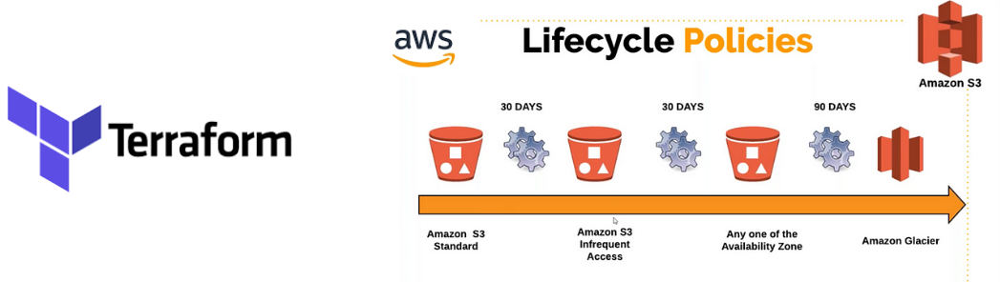

# Proyecto AWS S3 Bucket Configuration



Este proyecto de Terraform crea y configura un bucket de Amazon S3 con diversas características, incluyendo control de propiedad, control de acceso público, versiones, cifrado del lado del servidor, y políticas de IAM y de bucket. Adicionalmente, se configuran reglas de ciclo de vida para la transición y eliminación de objetos.

## Descripción del Proyecto

El proyecto define un bucket de S3 para el departamento de Marketing con las siguientes configuraciones:

- Creación del bucket con etiquetas específicas.
- Control de propiedad para que el dueño del bucket tenga preferencia.
- Bloqueo de acceso público con configuraciones específicas.
- Configuración de ACL para que el bucket sea privado.
- Habilitación de versionado del bucket.
- Creación de carpetas y objetos con cifrado del lado del servidor (SSE).
- Políticas de IAM para controlar el acceso a los objetos en el bucket.
- Políticas de bucket para control adicional del acceso.
- Reglas de ciclo de vida para la transición de objetos a clases de almacenamiento más baratas y eliminación después de un año.

## Requisitos Previos

- Tener una cuenta de AWS con los permisos necesarios para crear y gestionar recursos de S3 e IAM.
- Tener Terraform instalado en su máquina local.
- Configurar las credenciales de AWS en su máquina local.

## Recursos Configurados

1. Bucket de S3:

    * Nombre y etiquetas definidas por variables.
    * Control de propiedad BucketOwnerPreferred.
    * Bloqueo de acceso público configurado según las necesidades.

2. Versionado del Bucket:

    * Habilitación del versionado para el bucket.

3. Objetos en el Bucket:

    * Creación de carpetas y objetos con cifrado SSE y configuraciones de acceso.

4. Políticas de IAM:

    * Políticas de IAM para permitir listar y acceder a los objetos en el bucket según los prefijos definidos.

5. Política del Bucket:

    * Política del bucket para controlar el acceso según las condiciones especificadas.

6. Reglas de Ciclo de Vida:

    * Transición de objetos a STANDARD_IA después de 30 días.
    * Transición de objetos a GLACIER después de 100 días.
    * Eliminación de objetos después de un año.

## Instrucciones de uso 

1. Clonar este repositorio o descargar el código. 
2. Crear un archivo `terraform.tfvars` con las variables definidas. 
3. Inicializar Terraform y ejecutar la configuración: ```sh terraform init terraform plan terraform apply ``` Usa el código con precaución. 

## Notas 
- Este código es solo un ejemplo y puede necesitar ajustes para adaptarse a sus necesidades específicas. 
- Asegúrese de revisar los comentarios en el código para obtener más información sobre cada recurso. 
- Consulte la documentación de Terraform para obtener más información sobre la sintaxis y las opciones de configuración. ## Recursos adicionales 
- [Documentación de Terraform](https://developer.hashicorp.(com/terraform/tutorials)